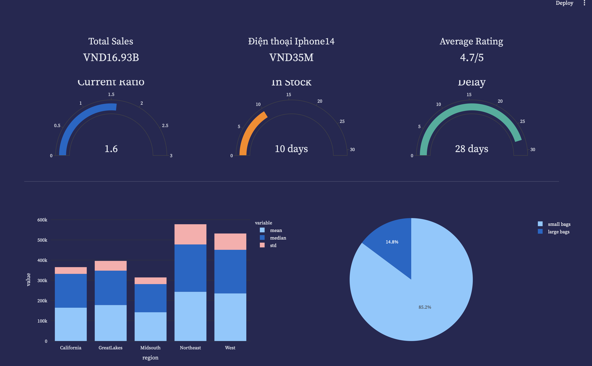

# TikTok Data Collection and Analysis Dashboard

## Project Overview

This project involves collecting data from TikTok using the TikTok API, building an interactive dashboard with Streamlit, and integrating PandasAI for advanced data analysis. The goal is to create a comprehensive tool for analyzing TikTok video metrics, trends, and user engagement.

## Objectives

- **Data Collection:** Retrieve data from TikTok using the TikTok API.
- **Dashboard Creation:** Build an interactive dashboard using Streamlit to visualize and interact with the collected data.
- **Advanced Analysis:** Integrate PandasAI to perform advanced analysis on additional data files.

## Key Features

- Collect TikTok video data including video IDs, descriptions, hashtags, view counts, like counts, and more.
- Interactive dashboard for visualizing and exploring data trends and metrics.
- Advanced data analysis capabilities using PandasAI.

## Tools and Technologies

- **Python:** Primary programming language used for the project.
- **TikTok API:** For data collection from TikTok.
- **Streamlit:** For building the interactive dashboard.
- **Pandas:** For data manipulation and analysis.
- **PandasAI:** For advanced data analysis on additional files.
- **Jupyter Notebook:** For organizing and documenting the analysis process.

### Prerequisites

- Python 3.x
- TikTok API credentials

## Results

The results of the analysis will be available through the Streamlit dashboard and detailed reports generated using PandasAI.

## Contributing

Contributions are welcome! Please fork the repository and submit a pull request with your changes. Ensure that your code adheres to the project's coding standards and includes appropriate tests.

## License

This project is licensed under the MIT License. See the [LICENSE](LICENSE) file for details.

## Contact

For any questions or feedback, please contact me at sonphamwork7@gmail.com.

---

